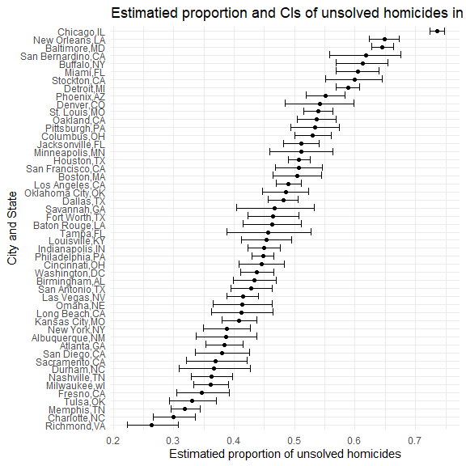
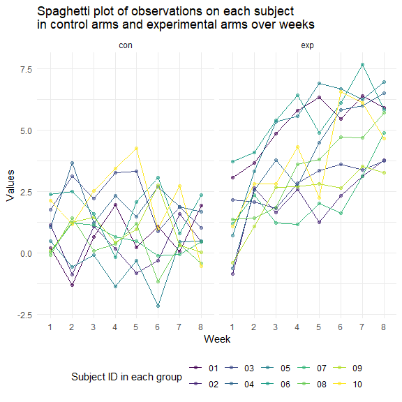

Homework 5
================
Mengfan Luo
11/20/2021

## Problem 1

### (a) Data loading, description and summary

``` r
homicide_data = read_csv("data/homicide-data.csv",na = c("","Unknown"))
```

In the raw data, there are `52179` observations and `12` columns. There
are 23075 missing values, including 60 lying in variable `lat`, 60 in
`lon`, and 2999 in `victim_age`. The variables include 8 character
variables
`uid`,`victim_last`,`victim_first`,`victim_race`,`victim_sex`,`city`,`state`
and `disposition`, and 4 numeric variables `reported_date`,`victim_age`,
`reported_date` and `reported_date`.

`city_state` variable is created to display both city and state
information. Total number of homicides and the number of unsolved
homicides within a city is summarized in the following table. We notice
that “Tulsa,AL” only has 1 total case, and in fact Tulsa is a city in OK
rather than AL, which indicate this might be a error in data entry. We
remove row with `city_state == "Tulsa,AL"` and keep
`city_state == "Tulsa,OK"`.

``` r
homicide_data = homicide_data %>% 
  mutate(city_state = str_c(city,state,sep = ","))

city_summary = homicide_data %>% 
  mutate(
    unsolved = case_when(
      disposition == "Closed by arrest" ~ 0,
      disposition != "Closed by arrest" ~ 1)
    ) %>% 
  group_by(city_state) %>% 
  summarize(city_total = n(),
            unsolved_total = sum(unsolved)) %>% 
  filter(city_state != "Tulsa,AL")
knitr::kable(city_summary)
```

| city\_state       | city\_total | unsolved\_total |
|:------------------|------------:|----------------:|
| Albuquerque,NM    |         378 |             146 |
| Atlanta,GA        |         973 |             373 |
| Baltimore,MD      |        2827 |            1825 |
| Baton Rouge,LA    |         424 |             196 |
| Birmingham,AL     |         800 |             347 |
| Boston,MA         |         614 |             310 |
| Buffalo,NY        |         521 |             319 |
| Charlotte,NC      |         687 |             206 |
| Chicago,IL        |        5535 |            4073 |
| Cincinnati,OH     |         694 |             309 |
| Columbus,OH       |        1084 |             575 |
| Dallas,TX         |        1567 |             754 |
| Denver,CO         |         312 |             169 |
| Detroit,MI        |        2519 |            1482 |
| Durham,NC         |         276 |             101 |
| Fort Worth,TX     |         549 |             255 |
| Fresno,CA         |         487 |             169 |
| Houston,TX        |        2942 |            1493 |
| Indianapolis,IN   |        1322 |             594 |
| Jacksonville,FL   |        1168 |             597 |
| Kansas City,MO    |        1190 |             486 |
| Las Vegas,NV      |        1381 |             572 |
| Long Beach,CA     |         378 |             156 |
| Los Angeles,CA    |        2257 |            1106 |
| Louisville,KY     |         576 |             261 |
| Memphis,TN        |        1514 |             483 |
| Miami,FL          |         744 |             450 |
| Milwaukee,wI      |        1115 |             403 |
| Minneapolis,MN    |         366 |             187 |
| Nashville,TN      |         767 |             278 |
| New Orleans,LA    |        1434 |             930 |
| New York,NY       |         627 |             243 |
| Oakland,CA        |         947 |             508 |
| Oklahoma City,OK  |         672 |             326 |
| Omaha,NE          |         409 |             169 |
| Philadelphia,PA   |        3037 |            1360 |
| Phoenix,AZ        |         914 |             504 |
| Pittsburgh,PA     |         631 |             337 |
| Richmond,VA       |         429 |             113 |
| Sacramento,CA     |         376 |             139 |
| San Antonio,TX    |         833 |             357 |
| San Bernardino,CA |         275 |             170 |
| San Diego,CA      |         461 |             175 |
| San Francisco,CA  |         663 |             336 |
| Savannah,GA       |         246 |             115 |
| St. Louis,MO      |        1677 |             905 |
| Stockton,CA       |         444 |             266 |
| Tampa,FL          |         208 |              95 |
| Tulsa,OK          |         583 |             193 |
| Washington,DC     |        1345 |             589 |

### (b) Proportion of unsolved homicides in Baltimore, MD

For the city of Baltimore, MD, `prop.test` function is used to estimate
the proportion of homicides that are unsolved and the output is saved in
`baltimore_output`.

-   My initial approach:

``` r
baltimore_total = city_summary %>%
  filter(city_state == "Baltimore,MD") %>% 
  pull(city_total)

baltimore_unsolved = city_summary %>%
  filter(city_state == "Baltimore,MD") %>% 
  pull(unsolved_total)


baltimore_output = prop.test(baltimore_unsolved,baltimore_total)


baltimore_estimate = broom::tidy(baltimore_output) %>% 
  pull(estimate)

baltimore_conf.low = broom::tidy(baltimore_output) %>% 
  pull(conf.low)

baltimore_conf.high = broom::tidy(baltimore_output) %>% 
  pull(conf.high)

baltimore_CI = c(baltimore_conf.low,baltimore_conf.high)
```

Using broom::tidy on `baltimore_output` to pull the estimated proportion
and confidence intervals, we get the estimate is 0.6455607 and 95% CI is
\[0.6275625, 0.6631599\].

The proportion of unsolved homicides and the confidence interval for
each cities are retrived using the following pipeline, and is shown in
the following table.

-   Revised method:

<!-- -->

    baltimore_summary= city_summary %>% 
      filter(city_state == "Baltimore,MD")

    baltimore_test = prop.test(
      x = baltimore_summary %>% pull(unsolved_total),
      n = baltimore_summary %>% pull(city_total)
    )

    baltimore_test %>% 
      broom::tidy()

### (c) Proportion of unsolved homicides in all cities

-   My approach

``` r
city_summary %>% 
  filter(city_state != "Tulsa,AL") %>% 
  mutate(output = map2(unsolved_total,city_total,prop.test),
         output = map(output,broom::tidy)) %>% 
  select(city_state,output) %>% 
  unnest(cols = c(output)) %>% 
  mutate(prop_unsolved = round(estimate,4),
    CI = str_c("[",round(conf.low,4),",",round(conf.high,4),"]")) %>% 
  select(city_state,prop_unsolved,CI) %>% 
  knitr::kable()
```

| city\_state       | prop\_unsolved | CI                |
|:------------------|---------------:|:------------------|
| Albuquerque,NM    |         0.3862 | \[0.3373,0.4376\] |
| Atlanta,GA        |         0.3834 | \[0.3528,0.4148\] |
| Baltimore,MD      |         0.6456 | \[0.6276,0.6632\] |
| Baton Rouge,LA    |         0.4623 | \[0.4142,0.511\]  |
| Birmingham,AL     |         0.4338 | \[0.3992,0.469\]  |
| Boston,MA         |         0.5049 | \[0.4646,0.5451\] |
| Buffalo,NY        |         0.6123 | \[0.5688,0.6541\] |
| Charlotte,NC      |         0.2999 | \[0.2661,0.3359\] |
| Chicago,IL        |         0.7359 | \[0.724,0.7474\]  |
| Cincinnati,OH     |         0.4452 | \[0.408,0.4831\]  |
| Columbus,OH       |         0.5304 | \[0.5002,0.5605\] |
| Dallas,TX         |         0.4812 | \[0.4562,0.5062\] |
| Denver,CO         |         0.5417 | \[0.4846,0.5977\] |
| Detroit,MI        |         0.5883 | \[0.5688,0.6076\] |
| Durham,NC         |         0.3659 | \[0.3096,0.4261\] |
| Fort Worth,TX     |         0.4645 | \[0.4223,0.5072\] |
| Fresno,CA         |         0.3470 | \[0.3051,0.3914\] |
| Houston,TX        |         0.5075 | \[0.4892,0.5257\] |
| Indianapolis,IN   |         0.4493 | \[0.4223,0.4766\] |
| Jacksonville,FL   |         0.5111 | \[0.482,0.5401\]  |
| Kansas City,MO    |         0.4084 | \[0.3804,0.437\]  |
| Las Vegas,NV      |         0.4142 | \[0.3881,0.4407\] |
| Long Beach,CA     |         0.4127 | \[0.3629,0.4643\] |
| Los Angeles,CA    |         0.4900 | \[0.4692,0.5109\] |
| Louisville,KY     |         0.4531 | \[0.4121,0.4948\] |
| Memphis,TN        |         0.3190 | \[0.2957,0.3433\] |
| Miami,FL          |         0.6048 | \[0.5686,0.64\]   |
| Milwaukee,wI      |         0.3614 | \[0.3333,0.3905\] |
| Minneapolis,MN    |         0.5109 | \[0.4585,0.5631\] |
| Nashville,TN      |         0.3625 | \[0.3286,0.3977\] |
| New Orleans,LA    |         0.6485 | \[0.6231,0.6732\] |
| New York,NY       |         0.3876 | \[0.3494,0.4271\] |
| Oakland,CA        |         0.5364 | \[0.5041,0.5685\] |
| Oklahoma City,OK  |         0.4851 | \[0.4468,0.5236\] |
| Omaha,NE          |         0.4132 | \[0.3653,0.4627\] |
| Philadelphia,PA   |         0.4478 | \[0.43,0.4657\]   |
| Phoenix,AZ        |         0.5514 | \[0.5185,0.5839\] |
| Pittsburgh,PA     |         0.5341 | \[0.4943,0.5735\] |
| Richmond,VA       |         0.2634 | \[0.2229,0.3083\] |
| Sacramento,CA     |         0.3697 | \[0.3212,0.4209\] |
| San Antonio,TX    |         0.4286 | \[0.3948,0.463\]  |
| San Bernardino,CA |         0.6182 | \[0.5577,0.6753\] |
| San Diego,CA      |         0.3796 | \[0.3354,0.4258\] |
| San Francisco,CA  |         0.5068 | \[0.4681,0.5454\] |
| Savannah,GA       |         0.4675 | \[0.4041,0.5319\] |
| St. Louis,MO      |         0.5397 | \[0.5154,0.5637\] |
| Stockton,CA       |         0.5991 | \[0.5517,0.6447\] |
| Tampa,FL          |         0.4567 | \[0.3881,0.527\]  |
| Tulsa,OK          |         0.3310 | \[0.2932,0.3711\] |
| Washington,DC     |         0.4379 | \[0.4112,0.4649\] |

-   Revised approach

<!-- -->

    prop_test_function = function(homicide_summary){
      homicide_test = prop.test(
        x = homicide_summary %>% pull(unsolved_total),
        n = homicide_summary %>% pull(city_total)
      )
      return(homicide_test)
    }

    results_df = city_summary %>%
      nest(data = city_total:unsolved_total) %>% 
      mutate(
        test_results = map(data,prop_test_function),
        tidy_results = map(test_results,broom::tidy)
      ) %>% 
      select(city_state,tidy_results) %>% 
      unnest(tidy_results) %>% 
      select(city_state,estimate,conf.low, conf.high)
      

### (d) Visualization of estimatied proportion and CIs of unsolved homicides in all cities

Create a plot that shows the estimates and CIs for each city – check out
geom\_errorbar for a way to add error bars based on the upper and lower
limits. Organize cities according to the proportion of unsolved
homicides.

-   My approach

``` r
city_summary %>% 
  mutate(output = map2(unsolved_total,city_total,prop.test),
         output = map(output,broom::tidy)) %>% 
  select(city_state,output) %>% 
  unnest(cols = c(output)) %>% 
  select(city_state,estimate,conf.low,conf.high) %>% 
  mutate(city_state = fct_reorder(city_state,estimate)) %>% 
  ggplot(aes(x = estimate,y = city_state))+
  geom_point()+
  geom_errorbar(aes(xmin = conf.low, xmax = conf.high))+
  labs(
    title = "Estimatied proportion and CIs of unsolved homicides in all cities",
    x = "Estimatied proportion of unsolved homicides",
    y = "City and State"
  )
```



-   Alternative approach

<!-- -->

    city_summary %>% 
      mutate(output = map2(unsolved_total,city_total,prop.test),
             output = map(output,broom::tidy)) %>% 
      select(city_state,output) %>% 
      unnest(cols = c(output)) %>% 
      select(city_state,estimate,conf.low,conf.high) %>% 
      mutate(city_state = fct_reorder(city_state,estimate)) %>% 
      ggplot(aes(x = city_state,y = estimate))+
      geom_point()+
      geom_errorbar(aes(ymin = conf.low, ymax = conf.high))+
      theme(axis.text.x = element_text(angle = 90, vjust = 0.5, hjust=1))

## Problem 2

### (a) Data loading and tidying

The following dataframe containing data from all participants, including
the subject ID, arm, and observations over week1 to week 8.

``` r
dataframe = tibble(
  filename = list.files(path = "./data/problem2/")
)

dataframe =  dataframe %>% 
  mutate(data = map(str_c("data/problem2/",filename),read_csv),
         filename = str_remove(filename,".csv")) %>% 
  unnest(data) %>% 
  separate(filename,into = c("arm","ID"),sep = "_") %>% 
  relocate(ID)

knitr::kable(dataframe)
```

| ID  | arm | week\_1 | week\_2 | week\_3 | week\_4 | week\_5 | week\_6 | week\_7 | week\_8 |
|:----|:----|--------:|--------:|--------:|--------:|--------:|--------:|--------:|--------:|
| 01  | con |    0.20 |   -1.31 |    0.66 |    1.96 |    0.23 |    1.09 |    0.05 |    1.94 |
| 02  | con |    1.13 |   -0.88 |    1.07 |    0.17 |   -0.83 |   -0.31 |    1.58 |    0.44 |
| 03  | con |    1.77 |    3.11 |    2.22 |    3.26 |    3.31 |    0.89 |    1.88 |    1.01 |
| 04  | con |    1.04 |    3.66 |    1.22 |    2.33 |    1.47 |    2.70 |    1.87 |    1.66 |
| 05  | con |    0.47 |   -0.58 |   -0.09 |   -1.37 |   -0.32 |   -2.17 |    0.45 |    0.48 |
| 06  | con |    2.37 |    2.50 |    1.59 |   -0.16 |    2.08 |    3.07 |    0.78 |    2.35 |
| 07  | con |    0.03 |    1.21 |    1.13 |    0.64 |    0.49 |   -0.12 |   -0.07 |    0.46 |
| 08  | con |   -0.08 |    1.42 |    0.09 |    0.36 |    1.18 |   -1.16 |    0.33 |   -0.44 |
| 09  | con |    0.08 |    1.24 |    1.44 |    0.41 |    0.95 |    2.75 |    0.30 |    0.03 |
| 10  | con |    2.14 |    1.15 |    2.52 |    3.44 |    4.26 |    0.97 |    2.73 |   -0.53 |
| 01  | exp |    3.05 |    3.67 |    4.84 |    5.80 |    6.33 |    5.46 |    6.38 |    5.91 |
| 02  | exp |   -0.84 |    2.63 |    1.64 |    2.58 |    1.24 |    2.32 |    3.11 |    3.78 |
| 03  | exp |    2.15 |    2.08 |    1.82 |    2.84 |    3.36 |    3.61 |    3.37 |    3.74 |
| 04  | exp |   -0.62 |    2.54 |    3.78 |    2.73 |    4.49 |    5.82 |    6.00 |    6.49 |
| 05  | exp |    0.70 |    3.33 |    5.34 |    5.57 |    6.90 |    6.66 |    6.24 |    6.95 |
| 06  | exp |    3.73 |    4.08 |    5.40 |    6.41 |    4.87 |    6.09 |    7.66 |    5.83 |
| 07  | exp |    1.18 |    2.35 |    1.23 |    1.17 |    2.02 |    1.61 |    3.13 |    4.88 |
| 08  | exp |    1.37 |    1.43 |    1.84 |    3.60 |    3.80 |    4.72 |    4.68 |    5.70 |
| 09  | exp |   -0.40 |    1.08 |    2.66 |    2.70 |    2.80 |    2.64 |    3.51 |    3.27 |
| 10  | exp |    1.09 |    2.80 |    2.80 |    4.30 |    2.25 |    6.57 |    6.09 |    4.64 |

### (b) Spaghetti plot of observations on each subject in control arms and experimental arms over weeks

``` r
dataframe %>% 
  pivot_longer(week_1:week_8,names_to = "week", values_to = "values") %>% 
  mutate(week = str_remove(week,"week_")) %>% 
  ggplot(aes(x = week, y = values, group = ID, color = ID))+
  geom_point(alpha = .5)+
  geom_line(size = .5)+
  facet_grid(.~arm)+
  labs(x = "Week", y = "Values",
       title = "Spaghetti plot of observations on each subject\nin control arms and experimental arms over weeks",
       color = "Subject ID in each group")
```



From the above spaghetti plot, there seem to be a larger increase over
week in the experimental arm than in the control arm. The values in week
1 is similar in both groups, but in week 8, all participants in
experimental arms have larger values than those in control arms.

## Problem 3

### Data loading, name cleaning and dataset overview

``` r
set.seed(10)

iris_with_missing = iris %>% 
  map_df(~replace(.x, sample(1:150, 20), NA)) %>%
  mutate(Species = as.character(Species))


iris_with_missing = iris_with_missing %>% 
  janitor::clean_names() 

#skimr::skim(iris_with_missing)
```

Using `skim()`, we can see there are 150 rows ad 5 columns, including 4
numeric variables `sepal_length`,`sepal_width`,`petal_length`, and
`petal_width`, and 1 character variable `species`. There are 100 missing
values, 20 among each variable.

### Filling in missing values

A function `fill_na_function` is defined to fill `NA` according to the
rules defined in the problem. The resulting dataframe after filling is
shown below.

``` r
fill_na_function = function(vec){
  if (is.numeric(vec)){
    mean = mean(vec,na.rm = TRUE)
    for (i in 1:length(vec)){
      if (is.na(vec[[i]])){
        vec = replace(vec,i,mean)
      }
    }
  }else if (is.character(vec)){
    for (i in 1:length(vec)){
      if (is.na(vec[[i]])){
        vec =  replace(vec,i,"virginica")
      }
    }
  }
  
  return(vec)
}

iris_without_missing = map_df(iris_with_missing,fill_na_function)

knitr::kable(iris_without_missing)
```

| sepal\_length | sepal\_width | petal\_length | petal\_width | species    |
|--------------:|-------------:|--------------:|-------------:|:-----------|
|      5.100000 |     3.500000 |      1.400000 |     0.200000 | setosa     |
|      4.900000 |     3.000000 |      1.400000 |     0.200000 | setosa     |
|      4.700000 |     3.200000 |      1.300000 |     0.200000 | setosa     |
|      4.600000 |     3.100000 |      1.500000 |     1.192308 | setosa     |
|      5.000000 |     3.600000 |      1.400000 |     0.200000 | setosa     |
|      5.400000 |     3.900000 |      1.700000 |     0.400000 | setosa     |
|      5.819231 |     3.400000 |      1.400000 |     0.300000 | setosa     |
|      5.000000 |     3.400000 |      1.500000 |     0.200000 | setosa     |
|      4.400000 |     2.900000 |      1.400000 |     0.200000 | setosa     |
|      4.900000 |     3.100000 |      3.765385 |     0.100000 | setosa     |
|      5.400000 |     3.075385 |      1.500000 |     0.200000 | setosa     |
|      4.800000 |     3.400000 |      1.600000 |     0.200000 | setosa     |
|      5.819231 |     3.075385 |      1.400000 |     0.100000 | setosa     |
|      4.300000 |     3.000000 |      3.765385 |     0.100000 | setosa     |
|      5.819231 |     4.000000 |      3.765385 |     0.200000 | setosa     |
|      5.700000 |     4.400000 |      1.500000 |     0.400000 | setosa     |
|      5.400000 |     3.900000 |      1.300000 |     0.400000 | setosa     |
|      5.100000 |     3.500000 |      1.400000 |     1.192308 | setosa     |
|      5.700000 |     3.800000 |      1.700000 |     0.300000 | setosa     |
|      5.100000 |     3.800000 |      1.500000 |     1.192308 | setosa     |
|      5.400000 |     3.400000 |      1.700000 |     0.200000 | setosa     |
|      5.100000 |     3.700000 |      1.500000 |     0.400000 | virginica  |
|      4.600000 |     3.600000 |      1.000000 |     0.200000 | setosa     |
|      5.819231 |     3.300000 |      3.765385 |     0.500000 | setosa     |
|      4.800000 |     3.400000 |      1.900000 |     0.200000 | virginica  |
|      5.000000 |     3.000000 |      3.765385 |     0.200000 | setosa     |
|      5.000000 |     3.400000 |      1.600000 |     0.400000 | virginica  |
|      5.200000 |     3.500000 |      1.500000 |     0.200000 | setosa     |
|      5.819231 |     3.400000 |      1.400000 |     0.200000 | setosa     |
|      4.700000 |     3.200000 |      1.600000 |     0.200000 | setosa     |
|      4.800000 |     3.100000 |      3.765385 |     0.200000 | setosa     |
|      5.400000 |     3.075385 |      1.500000 |     0.400000 | setosa     |
|      5.200000 |     3.075385 |      1.500000 |     0.100000 | setosa     |
|      5.500000 |     4.200000 |      1.400000 |     0.200000 | setosa     |
|      4.900000 |     3.100000 |      3.765385 |     0.200000 | setosa     |
|      5.000000 |     3.200000 |      1.200000 |     0.200000 | setosa     |
|      5.500000 |     3.500000 |      1.300000 |     0.200000 | setosa     |
|      4.900000 |     3.600000 |      1.400000 |     0.100000 | setosa     |
|      4.400000 |     3.000000 |      1.300000 |     1.192308 | setosa     |
|      5.100000 |     3.400000 |      1.500000 |     0.200000 | setosa     |
|      5.000000 |     3.500000 |      1.300000 |     0.300000 | setosa     |
|      4.500000 |     3.075385 |      1.300000 |     1.192308 | virginica  |
|      4.400000 |     3.200000 |      1.300000 |     0.200000 | setosa     |
|      5.000000 |     3.500000 |      1.600000 |     0.600000 | setosa     |
|      5.100000 |     3.800000 |      1.900000 |     0.400000 | setosa     |
|      4.800000 |     3.000000 |      1.400000 |     0.300000 | virginica  |
|      5.100000 |     3.800000 |      1.600000 |     0.200000 | setosa     |
|      4.600000 |     3.200000 |      3.765385 |     0.200000 | setosa     |
|      5.300000 |     3.700000 |      1.500000 |     0.200000 | setosa     |
|      5.000000 |     3.075385 |      1.400000 |     0.200000 | setosa     |
|      7.000000 |     3.075385 |      4.700000 |     1.400000 | virginica  |
|      6.400000 |     3.200000 |      4.500000 |     1.500000 | versicolor |
|      6.900000 |     3.100000 |      4.900000 |     1.500000 | versicolor |
|      5.500000 |     2.300000 |      4.000000 |     1.300000 | versicolor |
|      6.500000 |     2.800000 |      4.600000 |     1.500000 | versicolor |
|      5.700000 |     2.800000 |      4.500000 |     1.300000 | versicolor |
|      6.300000 |     3.300000 |      4.700000 |     1.600000 | virginica  |
|      4.900000 |     2.400000 |      3.765385 |     1.000000 | versicolor |
|      6.600000 |     2.900000 |      4.600000 |     1.300000 | virginica  |
|      5.200000 |     2.700000 |      3.900000 |     1.400000 | versicolor |
|      5.000000 |     2.000000 |      3.765385 |     1.000000 | versicolor |
|      5.900000 |     3.000000 |      4.200000 |     1.500000 | versicolor |
|      6.000000 |     2.200000 |      4.000000 |     1.192308 | versicolor |
|      6.100000 |     2.900000 |      4.700000 |     1.400000 | versicolor |
|      5.600000 |     2.900000 |      3.600000 |     1.300000 | versicolor |
|      6.700000 |     3.100000 |      4.400000 |     1.400000 | versicolor |
|      5.600000 |     3.000000 |      4.500000 |     1.500000 | versicolor |
|      5.800000 |     3.075385 |      4.100000 |     1.000000 | versicolor |
|      6.200000 |     2.200000 |      4.500000 |     1.500000 | versicolor |
|      5.600000 |     2.500000 |      3.900000 |     1.100000 | versicolor |
|      5.900000 |     3.200000 |      4.800000 |     1.800000 | versicolor |
|      5.819231 |     2.800000 |      4.000000 |     1.300000 | virginica  |
|      6.300000 |     2.500000 |      4.900000 |     1.500000 | versicolor |
|      5.819231 |     2.800000 |      3.765385 |     1.200000 | versicolor |
|      6.400000 |     2.900000 |      4.300000 |     1.300000 | versicolor |
|      6.600000 |     3.000000 |      4.400000 |     1.400000 | versicolor |
|      6.800000 |     2.800000 |      4.800000 |     1.400000 | versicolor |
|      6.700000 |     3.075385 |      5.000000 |     1.192308 | versicolor |
|      6.000000 |     3.075385 |      4.500000 |     1.192308 | versicolor |
|      5.700000 |     2.600000 |      3.500000 |     1.000000 | virginica  |
|      5.500000 |     2.400000 |      3.800000 |     1.100000 | versicolor |
|      5.819231 |     2.400000 |      3.700000 |     1.000000 | versicolor |
|      5.800000 |     2.700000 |      3.900000 |     1.200000 | versicolor |
|      6.000000 |     2.700000 |      5.100000 |     1.600000 | versicolor |
|      5.400000 |     3.000000 |      4.500000 |     1.500000 | versicolor |
|      5.819231 |     3.400000 |      4.500000 |     1.600000 | versicolor |
|      6.700000 |     3.100000 |      4.700000 |     1.192308 | versicolor |
|      5.819231 |     3.075385 |      4.400000 |     1.300000 | versicolor |
|      5.600000 |     3.000000 |      3.765385 |     1.192308 | versicolor |
|      5.500000 |     2.500000 |      4.000000 |     1.192308 | versicolor |
|      5.500000 |     3.075385 |      4.400000 |     1.200000 | versicolor |
|      5.819231 |     3.075385 |      4.600000 |     1.192308 | versicolor |
|      5.800000 |     3.075385 |      4.000000 |     1.192308 | versicolor |
|      5.000000 |     2.300000 |      3.300000 |     1.192308 | virginica  |
|      5.819231 |     2.700000 |      4.200000 |     1.300000 | versicolor |
|      5.700000 |     3.000000 |      4.200000 |     1.200000 | versicolor |
|      5.700000 |     2.900000 |      4.200000 |     1.300000 | versicolor |
|      6.200000 |     2.900000 |      4.300000 |     1.300000 | versicolor |
|      5.100000 |     2.500000 |      3.000000 |     1.192308 | versicolor |
|      5.700000 |     2.800000 |      4.100000 |     1.300000 | virginica  |
|      6.300000 |     3.075385 |      3.765385 |     2.500000 | virginica  |
|      5.800000 |     2.700000 |      5.100000 |     1.900000 | virginica  |
|      7.100000 |     3.000000 |      5.900000 |     2.100000 | virginica  |
|      6.300000 |     2.900000 |      5.600000 |     1.800000 | virginica  |
|      6.500000 |     3.075385 |      5.800000 |     2.200000 | virginica  |
|      7.600000 |     3.000000 |      6.600000 |     2.100000 | virginica  |
|      4.900000 |     2.500000 |      4.500000 |     1.700000 | virginica  |
|      7.300000 |     2.900000 |      6.300000 |     1.800000 | virginica  |
|      6.700000 |     3.075385 |      3.765385 |     1.800000 | virginica  |
|      5.819231 |     3.600000 |      3.765385 |     2.500000 | virginica  |
|      6.500000 |     3.200000 |      5.100000 |     2.000000 | virginica  |
|      5.819231 |     2.700000 |      5.300000 |     1.900000 | virginica  |
|      6.800000 |     3.000000 |      5.500000 |     2.100000 | virginica  |
|      5.700000 |     3.075385 |      5.000000 |     2.000000 | virginica  |
|      5.800000 |     2.800000 |      5.100000 |     2.400000 | virginica  |
|      6.400000 |     3.200000 |      5.300000 |     2.300000 | virginica  |
|      6.500000 |     3.000000 |      3.765385 |     1.800000 | virginica  |
|      7.700000 |     3.800000 |      6.700000 |     1.192308 | virginica  |
|      7.700000 |     2.600000 |      6.900000 |     2.300000 | virginica  |
|      6.000000 |     2.200000 |      5.000000 |     1.500000 | virginica  |
|      5.819231 |     3.200000 |      5.700000 |     1.192308 | virginica  |
|      5.600000 |     3.075385 |      4.900000 |     2.000000 | virginica  |
|      7.700000 |     2.800000 |      6.700000 |     2.000000 | virginica  |
|      6.300000 |     2.700000 |      4.900000 |     1.800000 | virginica  |
|      6.700000 |     3.300000 |      5.700000 |     2.100000 | virginica  |
|      7.200000 |     3.200000 |      6.000000 |     1.800000 | virginica  |
|      6.200000 |     2.800000 |      4.800000 |     1.800000 | virginica  |
|      6.100000 |     3.000000 |      4.900000 |     1.800000 | virginica  |
|      6.400000 |     2.800000 |      5.600000 |     2.100000 | virginica  |
|      7.200000 |     3.000000 |      5.800000 |     1.600000 | virginica  |
|      7.400000 |     2.800000 |      6.100000 |     1.192308 | virginica  |
|      7.900000 |     3.800000 |      3.765385 |     2.000000 | virginica  |
|      6.400000 |     2.800000 |      3.765385 |     2.200000 | virginica  |
|      5.819231 |     2.800000 |      5.100000 |     1.500000 | virginica  |
|      6.100000 |     3.075385 |      5.600000 |     1.400000 | virginica  |
|      5.819231 |     3.000000 |      6.100000 |     2.300000 | virginica  |
|      5.819231 |     3.400000 |      5.600000 |     1.192308 | virginica  |
|      6.400000 |     3.100000 |      5.500000 |     1.192308 | virginica  |
|      6.000000 |     3.000000 |      4.800000 |     1.800000 | virginica  |
|      6.900000 |     3.100000 |      5.400000 |     2.100000 | virginica  |
|      6.700000 |     3.100000 |      5.600000 |     2.400000 | virginica  |
|      6.900000 |     3.100000 |      5.100000 |     2.300000 | virginica  |
|      5.819231 |     2.700000 |      5.100000 |     1.900000 | virginica  |
|      6.800000 |     3.200000 |      3.765385 |     2.300000 | virginica  |
|      6.700000 |     3.300000 |      3.765385 |     2.500000 | virginica  |
|      6.700000 |     3.000000 |      5.200000 |     2.300000 | virginica  |
|      6.300000 |     2.500000 |      5.000000 |     1.900000 | virginica  |
|      6.500000 |     3.000000 |      5.200000 |     2.000000 | virginica  |
|      5.819231 |     3.400000 |      5.400000 |     2.300000 | virginica  |
|      5.900000 |     3.000000 |      5.100000 |     1.800000 | virginica  |
